# 🏡 RoomieSync – Shared Living & Expense Management Web App

RoomieSync is a modern, full-stack web application designed for roommates to seamlessly manage shared expenses, track monthly budgets, assign tasks, swap tasks using bounties, and communicate via a live notice board.

---

## ✨ Features

- 💰 **Automated Expense Splitting & Ledger:** Track daily spends, auto-split costs equally, and view category-wise analytics.
- 🤝 **Settlement Management:** Centralized clearing hub for Admin/Settlement Head to manage dues and verify transactions.
- 🎁 **Task Bounty & Swap Market:** Post monetary rewards on pending tasks so flatmates can claim them for extra cash.
- 📌 **Live Notice Board:** Broadcast instant announcements, reminders, and updates across all connected accounts.
- 📊 **CSV Report Export:** Download professional billing cycle summaries and expense distribution in CSV format.
- 🌗 **Responsive Modern UI:** Theme support (Dark/Light mode), smooth Framer Motion animations, and instant Toast alerts.

---

## 🛠️ Tech Stack

### Frontend
- **Framework:** React.js (Vite)
- **Styling:** Tailwind CSS, Framer Motion
- **Icons:** Lucide React
- **Data Visualization:** Recharts
- **HTTP Client:** Axios

### Backend
- **Framework:** Java Spring Boot
- **ORM / Database:** Hibernate, JPA, MySQL
- **Architecture:** RESTful APIs, Role-Based Access Control (RBAC)

---

## 📸 App UI Gallery

  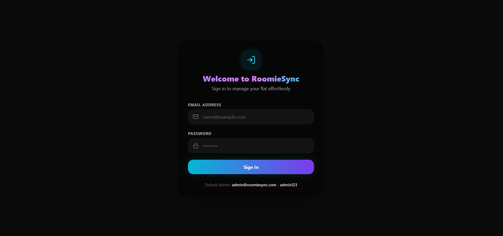
  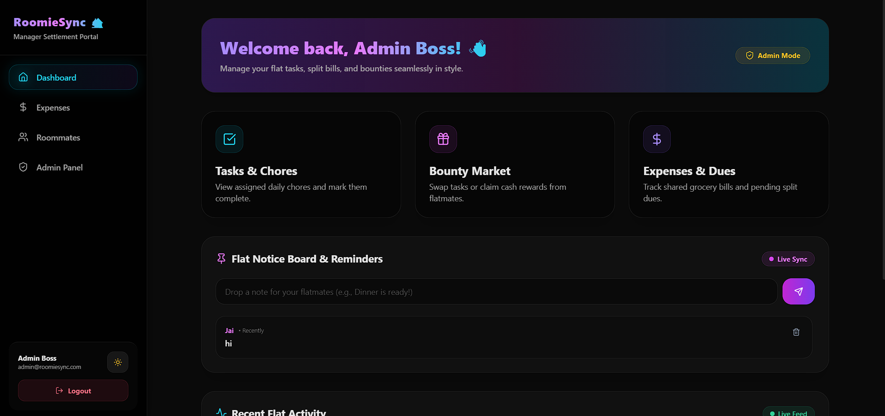

  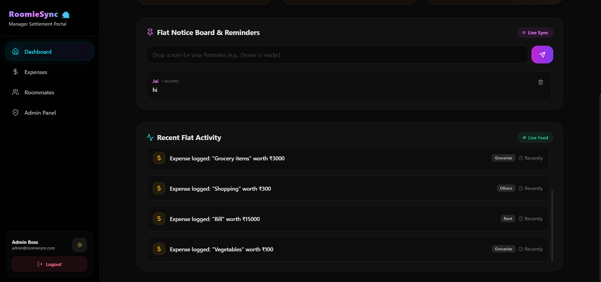
  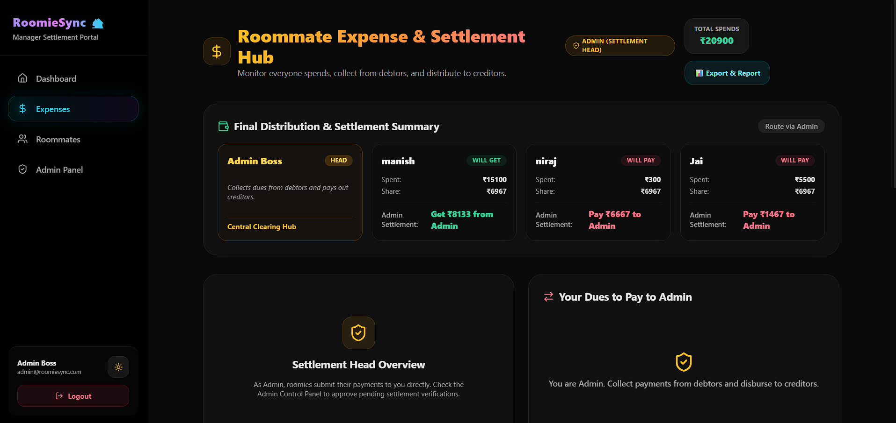

  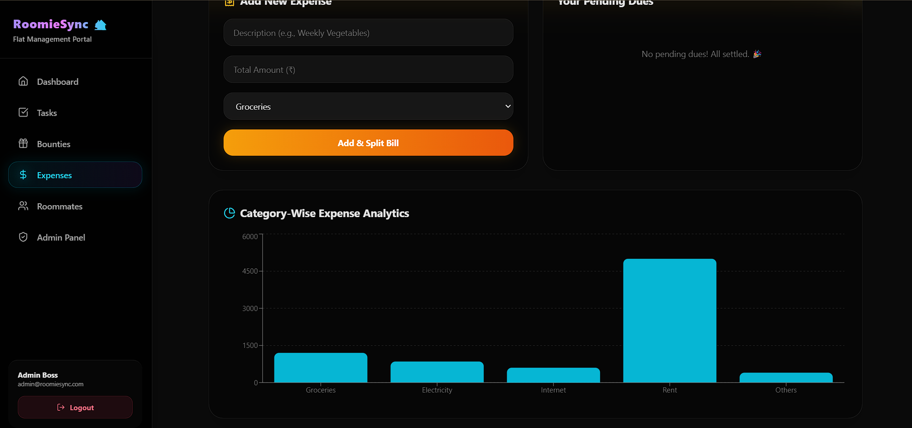
  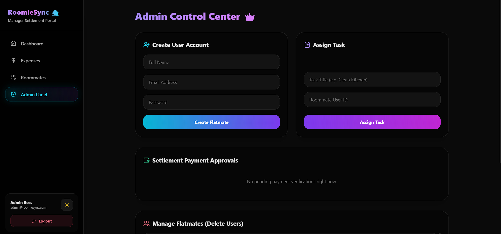

  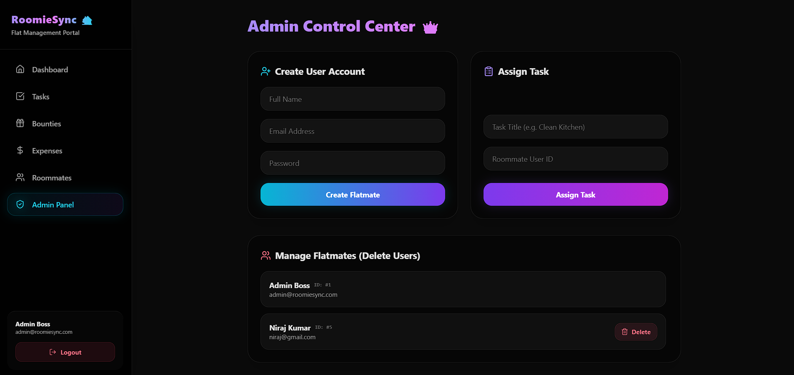
  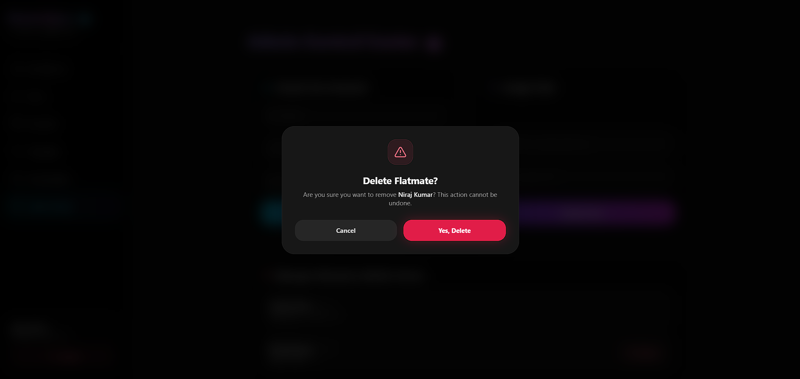

  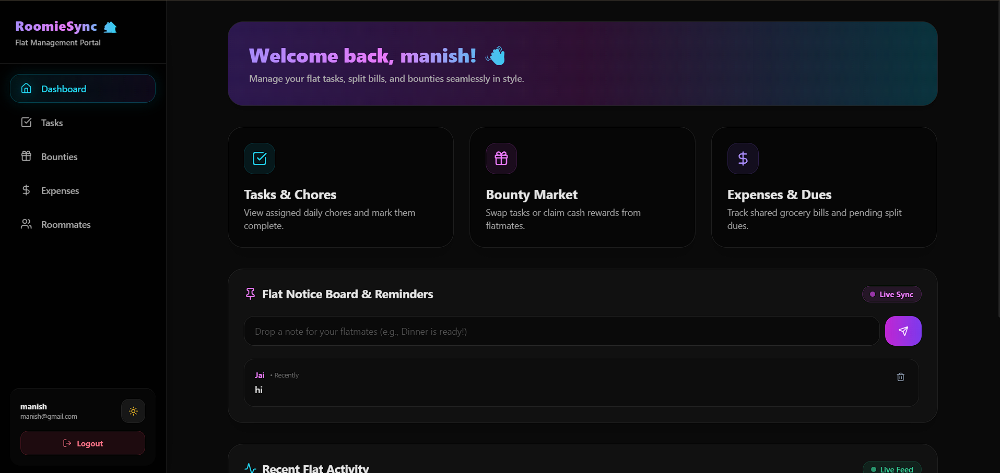
  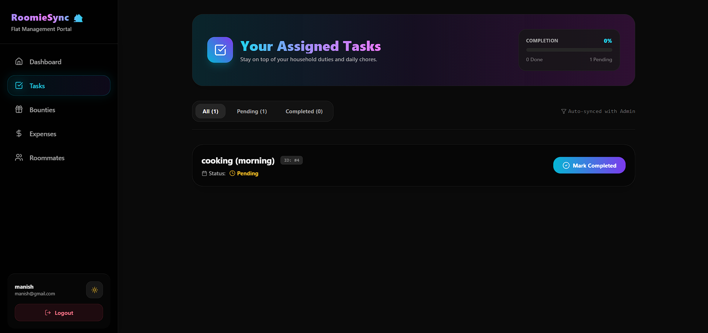

  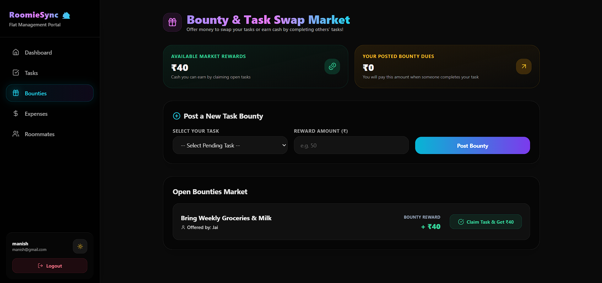
  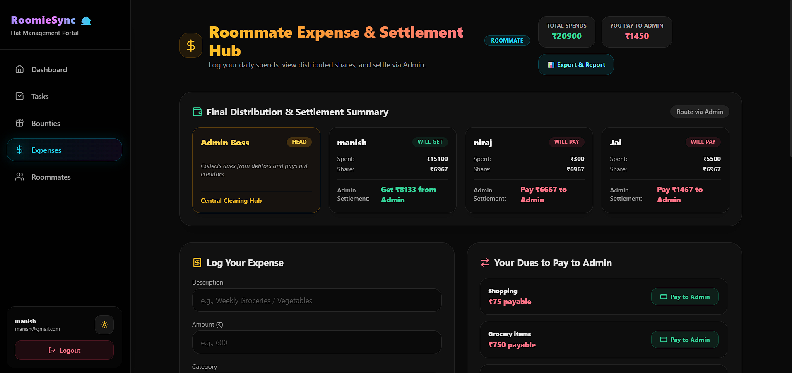

  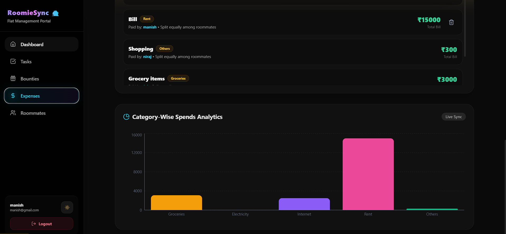
  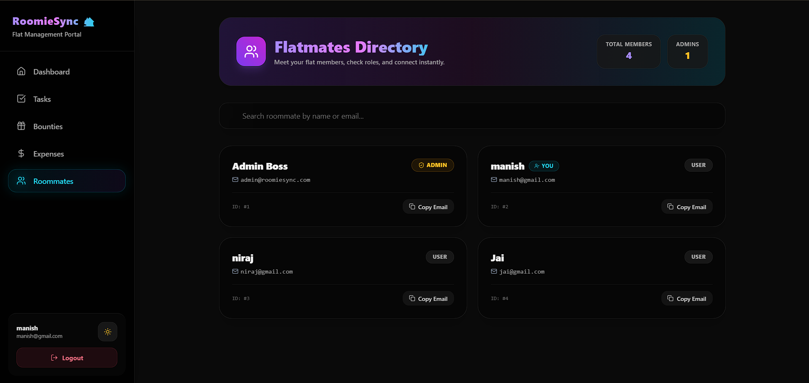

---

## 👤 Author

**Jai Vishun Singh**
- GitHub: [@SinghVishunJai1](https://github.com/SinghVishunJai1)
- Degree: B.Tech in Computer Science & Engineering
